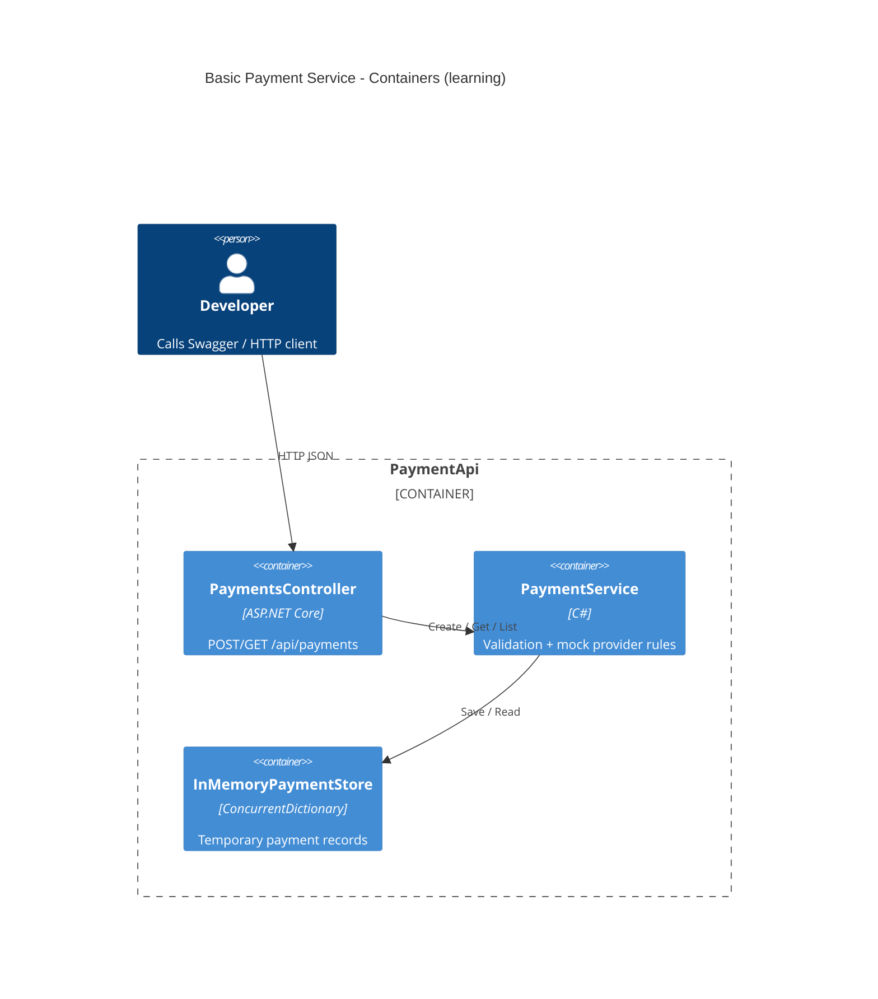

# Architecture (learning view)

Simple layered ASP.NET Core 8 API — educational, not production.



## Request flow

```text
Client
  → PaymentsController.Create(CreatePaymentRequest)
    → PaymentService.CreatePayment()
         1) Validate request
         2) Reject duplicate orderNumber
         3) Evaluate demo card rules
         4) Save Payment
         5) Return PaymentResult
  ← 200 OK / 400 Bad Request
```

## Why in-memory store?

For learning:

- Zero infrastructure
- Instant feedback
- Same interface later maps to SQL

Data resets when the process stops — that is intentional.
